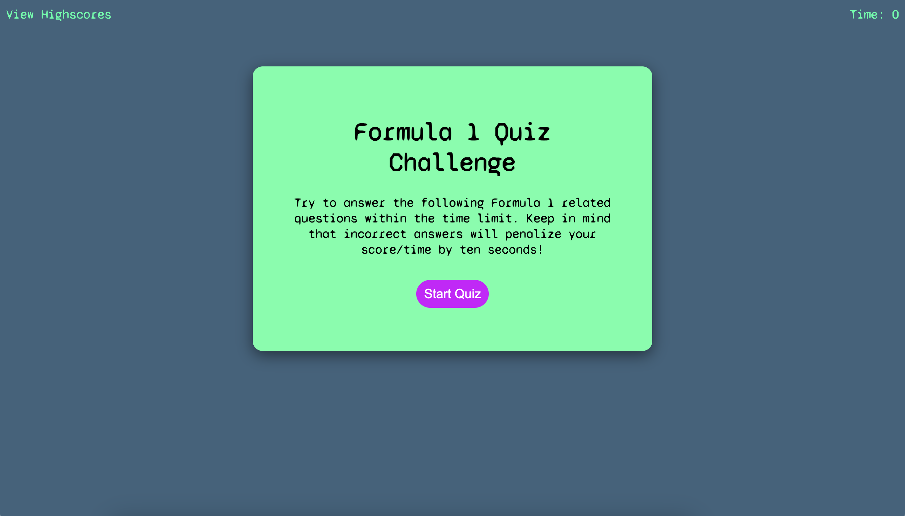
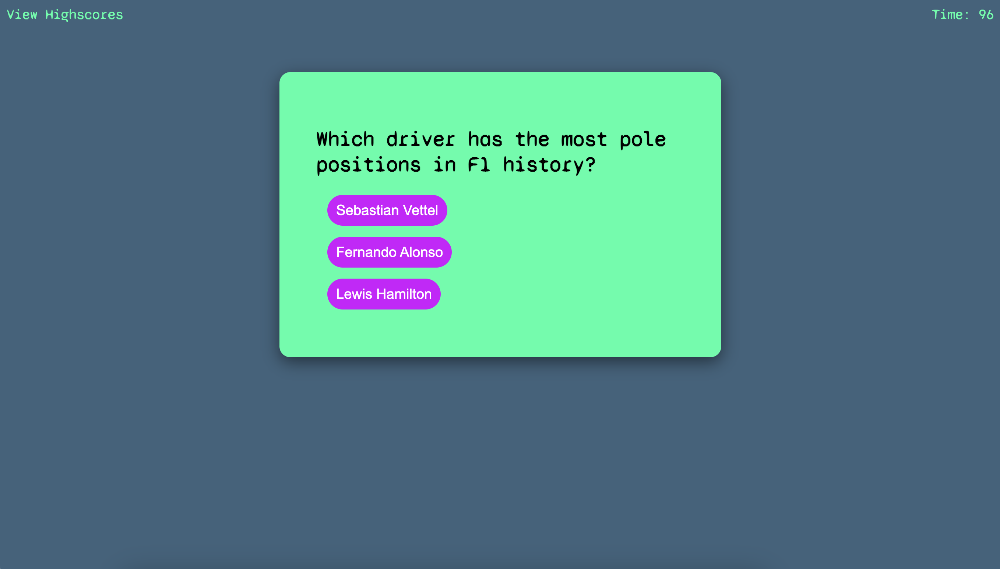
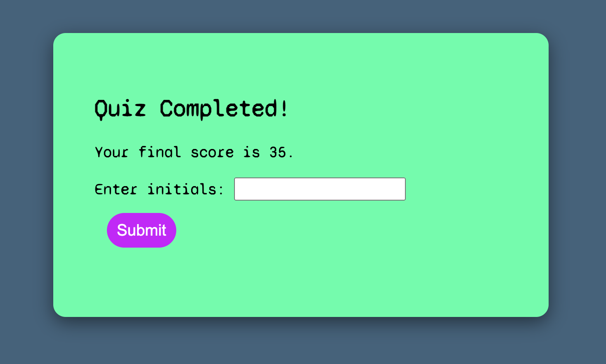
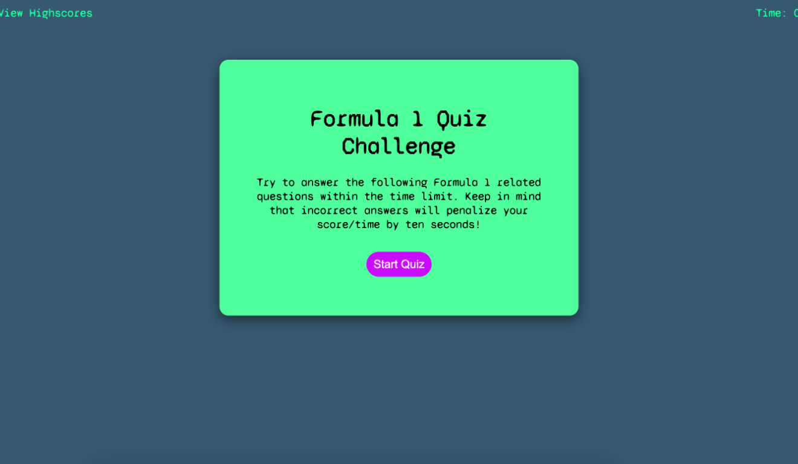

# Formula 1 Quiz

## The Task:

* I have been tasked with creating a quiz app using HTML, CSS and Javascript.

**Instructions**

* Create an app that meets the following criteria:

    * Present a number of questions relating to Formula 1.
    * Start the quiz with a time of 100 seconds.
    * Once the quiz has started, decrement the timer until it reaches 0.
    * Save and display high scores with users initials.

## Installation

To run, simply open the following link in your Chrome web browser. Once open, click the `start` button to start the quiz. You have 100 seconds to answer the questions, each incorrect answer will result in a 10 second time penalty which is removed from your remaining time. At the end of the quiz, any remaining time will be added as your score.

`if the timer reaches 0 before the quiz has ended, it's game over!`

To submit your score, please enter your initials (no more than 3 characters) and submit. Your scores will be saved in local storage.

To start the quiz again, simply hit the `back` button or refresh your browser window.

You can play the quiz via the following link:

Formula 1 Quiz: https://shaky411.github.io/F1-Quiz

## Usage

## Screenshots

## SC

## Credits

N/A

## License

Please refer to the license in the repo.
